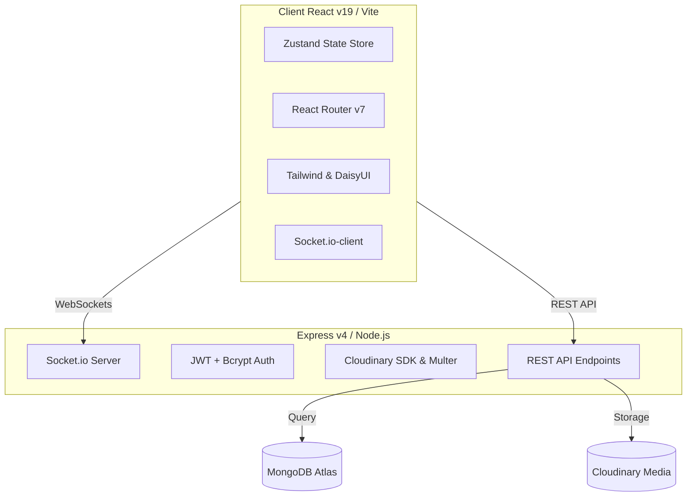

# 💬 TalkSpace — Real-Time Chat, Calling & Status Platform

TalkSpace is a premium, feature-rich real-time communication platform designed to offer seamless messaging, voice calls, and transient status updates. Built using the **MERN (MongoDB, Express, React, Node.js)** stack, the application features an immersive UI inspired by WhatsApp and Discord, customized with **Tailwind CSS** and **DaisyUI** themes.

---

## 🎨 Application Showcase

Below is a design preview of the TalkSpace platform showing the modern, theme controls, and communication center.


---

## 🚀 Key Features

### 1. 💬 Real-Time Messaging Hub
*   **Instant Message Delivery:** Powered by WebSockets via Socket.io for immediate text and image delivery.
*   **Dynamic UI Indicators:** Real-time **"Typing..."** prompts, online status rings, and automatic message read receipts.
*   **Unread Badges:** High-visibility bounce-animated counters indicating unread message counts per user.
*   **Message Deletion:** Fully supported server-side deletion reflecting across clients in real-time.

### 2. 📞 Immersive Voice Calling (WebRTC)
*   **Encrypted Calling Experience:** Implements real-time signaling via Socket.io for voice connection establishment, accept/reject feedback, and hang-up logic.
*   **WhatsApp-Style Interface:** Audio visualizer waves, large pulsing profile avatars, mute toggle capabilities, and duration timers.
*   **Picture-in-Picture (PiP):** Minimize the active call window to a floating dashboard PIP, allowing you to browse chats during active call streams.
*   **Persistent Call Logs:** Tracks missed/completed/outgoing calls in MongoDB and logs them to the Call History feed.

### 3. ⏳ Status Updates & Stories (WhatsApp-Style)
*   **Transient Media Sharing:** Share text, image, or video status updates that automatically self-delete after 24 hours.
*   **Viewer Analytics:** Real-time tracking of contacts who have viewed your status updates.
*   **Story Quick Replies:** Reply directly to a status update, which automatically routes a chat message pointing to the specific status media.

### 4. 🎨 Adaptive Styling & Personalization
*   **Theme Engine:** Seamless integration with DaisyUI's library of 32+ custom color configurations (Retro, Cyberpunk, Synthwave, luxury, etc.).
*   **Local Storage Persistence:** Keeps your preferred theme selection active across browser sessions.
*   **Fully Responsive Layout:** Optimizes spacing and collapses contact list panels for a clean mobile-first view.

---

## 🛠️ Architecture & Tech Stack



### Technical Specs:
*   **Frontend Framework:** React (v19) powered by Vite.
*   **State Management:** Zustand (lightweight, reactive store).
*   **Real-time Layer:** Socket.io (WebSockets).
*   **Database:** MongoDB via Mongoose.
*   **Media Storage:** Cloudinary integration for profile photos, stories, and chat attachments.
*   **Security:** JWT-based user cookies, password hashing with bcryptjs, and Express route-rate limiters.

---

## 📂 Project Structure

```text
ChatApplication/
├── Backend/                 # Express Server & REST API
│   ├── config/              # DB connection & configuration
│   ├── controllers/         # Business logic (Auth, Messages, Calls, Status)
│   ├── middleware/          # JWT check & Rate-limiting middleware
│   ├── models/              # Mongoose DB Schemas
│   ├── routes/              # Express API Routes
│   ├── server.js            # Node HTTP server & Socket.io engine
│   └── app.js               # Express application initialization
├── Frontend/                # Vite React Single Page Application
│   ├── public/              # Static assets
│   ├── src/
│   │   ├── components/      # Reusable UI (Sidebar, ChatContainer, CallHistory, StatusPane, etc.)
│   │   ├── pages/           # View pages (Login, SignUp, Home, Settings, Profile)
│   │   ├── store/           # Zustand global state stores (useAuthStore, useChatStore, etc.)
│   │   ├── main.jsx         # App mounting entrypoint
│   │   └── App.jsx          # Route manager & global layout
└── assets/                  # Documentation mockups & media
```

---

## ⚙️ Environment Variables Setup

Before running the application, you need to configure your environment variables.

### 1. Backend Configuration
Create a `.env` file inside the `/Backend` directory:

```env
PORT=5000
MONGO_URI=your_mongodb_connection_string
JWT_SECRET=your_jwt_secret_key_string
FRONTEND_URL=http://localhost:5173
NODE_ENV=development

# Cloudinary Credentials (For image uploads & stories)
CLOUDINARY_CLOUD_NAME=your_cloudinary_cloud_name
CLOUDINARY_API_KEY=your_cloudinary_api_key
CLOUDINARY_API_SECRET=your_cloudinary_api_secret
```

### 2. Frontend Configuration
Create a `.env` file inside the `/Frontend` directory:

```env
NODE_ENV=development
VITE_API_BASE_URL=http://localhost:5000/api
VITE_API_URL=http://localhost:5000/api
VITE_SOCKET_URL=http://localhost:5000
```

---

## 🏃 Local Installation & Running

### Prerequisites
*   [Node.js](https://nodejs.org/en/) installed (v18+ recommended)
*   [MongoDB](https://www.mongodb.com/) Database (Atlas Cloud or local instance)
*   Free Account at [Cloudinary](https://cloudinary.com/) for cloud file hosting

### Step-by-Step Guide

1.  **Clone the Repository:**
    ```bash
    git clone https://github.com/Adshkumar/ChatApplication.git
    cd ChatApplication
    ```

2.  **Install All Dependencies:**
    You can install dependencies for both folders by running this script in the root directory:
    ```bash
    # Installs root, frontend and backend dependencies
    npm run install-frontend && cd Backend && npm install
    ```

3.  **Start the Backend Development Server:**
    ```bash
    cd Backend
    npm run dev
    ```
    The API server should launch on `http://localhost:5000`.

4.  **Start the Frontend Development Server:**
    In a new terminal window:
    ```bash
    cd Frontend
    npm run dev
    ```
    The application interface will open at `http://localhost:5173`.

---

## 📞 Socket.io WebSockets & WebRTC Signaling Events

For reference, the WebSocket server manages communications through the following event lifecycle:

| Event Name | Sent By | Description |
| :--- | :--- | :--- |
| `connection` | Client | Fired when a client registers with their query `userId`. Joins a room specific to that ID. |
| `getOnlineUsers` | Server | Broadcasts the list of active user IDs to all online clients. |
| `call-user` | Client | Signals an incoming call, creates a "missed" call log in DB, and fires `incoming-call` event to recipient. |
| `call-accepted` | Client | Routes WebRTC handshake answer parameters to the active caller's endpoint. |
| `call-rejected` | Client | Relays decline signaling to end ringers. |
| `end-call` | Client | Concludes active sessions and updates database call log status to `completed`. |
| `disconnect` | Client | Clears socket mapped instances and updates client presence. |

---

## 🤝 Contributing

Contributions make the open-source community an amazing place to learn, inspire, and create. Any contributions you make are **greatly appreciated**.

1. Fork the Project
2. Create your Feature Branch (`git checkout -b feature/AmazingFeature`)
3. Commit your Changes (`git commit -m 'Add some AmazingFeature'`)
4. Push to the Branch (`git push origin feature/AmazingFeature`)
5. Open a Pull Request

---

## 📄 License

Distributed under the MIT License. See `LICENSE` for more information.

---

*Made with 💖 by [Adarsh Kumar](https://github.com/Adshkumar)*
